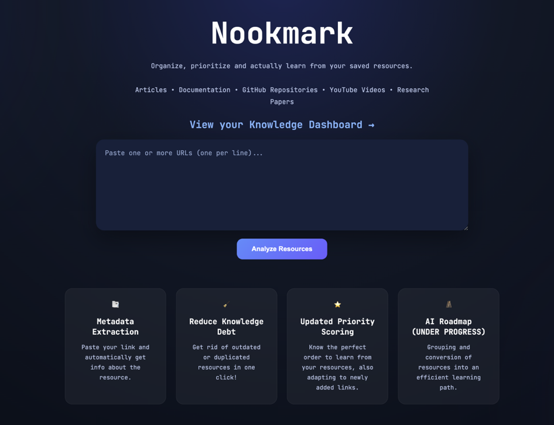
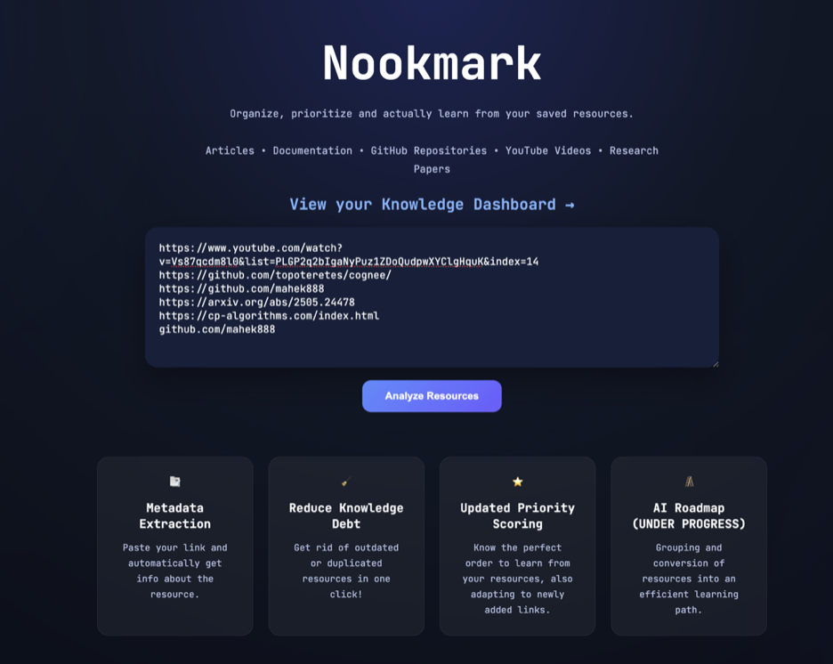
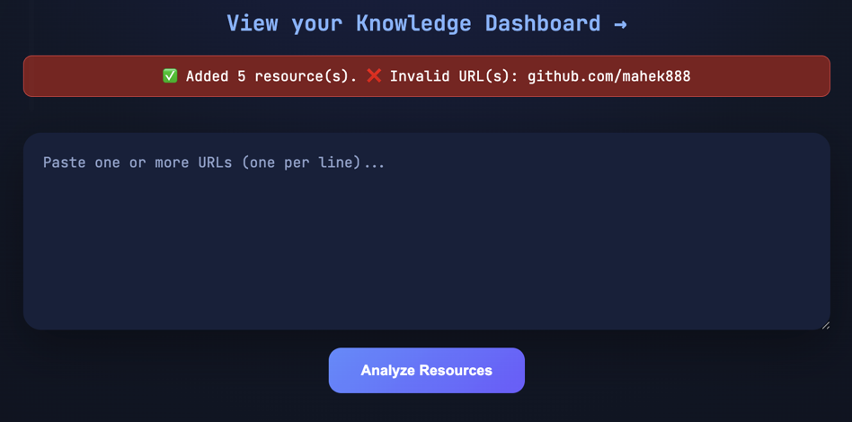
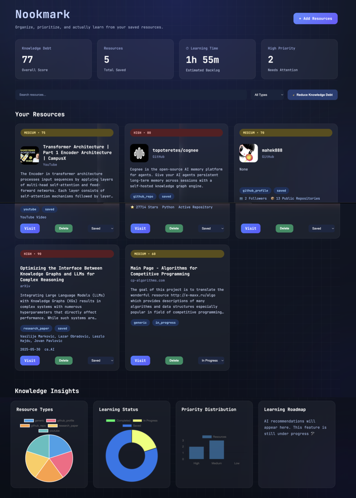
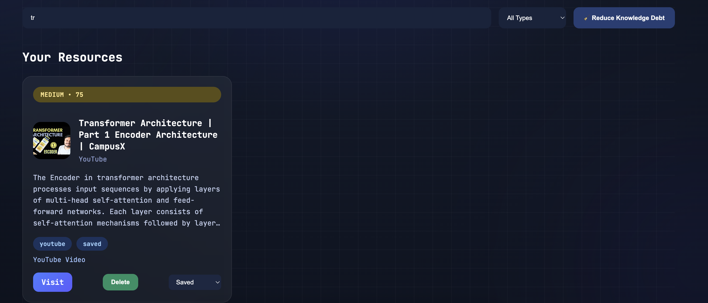

# 🏷️ Nookmark

> An intelligent bookmark manager for organizing the growing collection of saved learning resources.

## 📎 Overview

Every learner eventually ends up with hundreds of saved resources spread across YouTube watch-later videos, GitHub stars, research papers, blogs, and documentation. Finding what to learn next and managing those resources becomes harder than learning itself.

Nookmark solves this problem by automatically collecting, organizing, prioritizing, and analyzing learning resources in one place.

Instead of another bookmark list, Nookmark helps reduce **knowledge debt** by identifying what deserves attention first!

---

## Screenshots

### Landing Page



---

### Paste your links



---

### Error handling of invalid URLs



---

### Full dashboard



---

### Search and filters



---

## ⭐ Features

### ✦︎ Smart Resource Import
- Import multiple URLs simultaneously
- Supports:
  - GitHub repositories
  - GitHub profiles
  - arXiv research papers
  - YouTube videos
  - Generic websites & documentation

### ✦︎ Automatic Metadata Extraction
Automatically fetches:
- Title
- Description
- Thumbnail
- Resource type
- GitHub stars & language
- arXiv authors & category
- Source information

### ✦︎ Priority Scoring
Each resource receives a priority score based on factors such as:
- Resource type
- Learning value
- Freshness
- Current learning status

### ✦︎ Knowledge Debt Reduction
Automatically:
- Removes duplicate resources
- Detects dead links
- Calculates an overall Knowledge Debt Score

### ✦︎ Interactive Dashboard
Visualize your learning collection with:
- Resource type distribution
- Learning status breakdown
- Priority distribution
- Estimated learning time (Some values currently deterministic)
- Knowledge Debt Score

### ✦︎ Search & Filter
Quickly search and filter resources by:
- Title
- Resource type
- Learning status

### ✦︎ Learning Progress Tracking
Mark resources as:
- Saved
- In Progress
- Completed

### ✦︎ Resource Management
- Delete resources
- Update learning status
- Visit original source

### ✦︎ Error Handling
Gracefully handles:
- Invalid URLs
- Unsupported resources

---

## 🔨 Tech Stack

### Backend
- Python
- Flask

### Frontend
- HTML
- CSS
- JavaScript
- Jinja2

### APIs
- GitHub REST API
- YouTube Data API
- arXiv API

### Data Storage
- JSON

### Visualization
- Chart.js

---

## 🗂️ Project Structure

```text
Nookmark/
│
├── app.py
├── Procfile
├── runtime.txt
├── requirements.txt
├── README.md
├── .env.example
│
├── data/
│   └── resources.json
│
├── services/
│   ├── analytics.py
│   ├── cleanup.py
│   ├── learning_time.py
│   ├── resource_manager.py
│   ├── scoring.py
│   │
│   └── metadata/
│       ├── detector.py
│       ├── github.py
│       ├── youtube.py
│       ├── arxiv.py
│       └── generic.py
│
├── static/
│   ├── css/
│   │   └── style.css
│   └── js/
│       └── script.js
│
└── templates/
    ├── index.html
    ├── dashboard.html
    └── roadmap.html
```

---

## ⬇️ Installation

Clone the repository

```bash
git clone https://github.com/mahek888/Nookmark.git
cd Nookmark
```

Create a virtual environment

```bash
python -m venv .venv
```

Install dependencies

```bash
pip install -r requirements.txt
```

Create a `.env` file

```env
YOUTUBE_API_KEY=YOUR_API_KEY
GITHUB_TOKEN=your_github_personal_access_token_here
```


Run the application

```bash
python app.py
```

---

## 🚀 Future Additions

- AI-generated learning roadmaps
- AI topic clustering
- Cloud database support
- User authentication
- Browser bookmark import
- Chrome extension
- Smarter learning time estimation

---

## 💭 Reflection

The hardest part of building Nookmark was making it work reliably across different types of learning resources. Every platform—GitHub, arXiv, YouTube, and generic websites—returns metadata in a different format, so getting everything into one consistent structure took a lot of debugging. I also spent quite a bit of time handling deployment issues.

If I had more time, the first feature I would finish is the AI-powered learning roadmap. I had the overall architecture ready, but finding a reliable free LLM API that worked consistently within the project timeline turned out to be more difficult than expected. Rather than shipping a feature that only worked sometimes, I decided to focus on making the core experience stable. I would also replace the current JSON storage with a proper database and add user authentication so every user has their own personalized collection of learning resources. The current learning time estimator uses accurate values for Youtube Videos but it is deterministic for other resources, this is one feature I want to improve as well.

This project made me much more comfortable building complete Flask applications from scratch. I gained experience working with REST APIs, JSON data, Jinja templates, Chart.js visualizations, deployment on Render, and structuring a project into reusable modules. 
